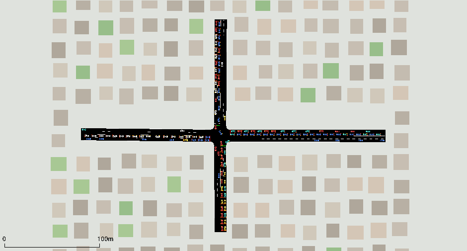

# 🚦 Multi-Agent Traffic Flow Optimization via Reinforcement Learning

> **Institution:** Institut National des Postes et Télécommunications (INPT), Rabat
> **Specialization:** Advanced Software Engineering for Digital Services (ASEDS)
> **Authors:** Taha El Badaoui & Walid Hazzam

---

## 📝 Project Architecture & Current State

This project implements high-performance reinforcement learning policies for adaptive traffic signal control using **Proximal Policy Optimization (PPO)** and the **Simulation of Urban MObility (SUMO)** framework.

Traditional traffic lights operate using static timing plans that cannot react effectively to changing traffic conditions. This work replaces predefined schedules with learned policies capable of adapting in real time based on observed traffic states.

The project currently supports both **single-intersection optimization** and **coordinated multi-intersection control**, enabling experimentation with centralized traffic management strategies and scalable reinforcement learning architectures.

### Key Features

#### Parallelized PPO Training

To accelerate training, environments are vectorized using **SubprocVecEnv**, allowing multiple SUMO simulations to run simultaneously across CPU cores.

Each worker process dynamically generates its own traffic configuration and route files, preventing file collisions and enabling robust randomized training.

#### Observation Normalization

Training and evaluation use **VecNormalize** to stabilize learning and improve policy generalization.

Evaluation scripts enforce strict consistency between trained models and normalization statistics. Missing normalization files automatically trigger execution safeguards to prevent invalid inference results.

#### Multi-Agent Corridor Optimization

The project includes a coordinated corridor composed of two consecutive intersections.

A centralized PPO agent controls both traffic lights simultaneously using a flattened global observation space, enabling the emergence of synchronization strategies commonly referred to as a **Green Wave**, where vehicle platoons experience consecutive green signals along a corridor.

---

## 🛠 Technology Stack

| Component                 | Technology                          |
| ------------------------- | ----------------------------------- |
| Simulator                 | SUMO (Simulation of Urban MObility) |
| Reinforcement Learning    | Stable-Baselines3 PPO               |
| Environment API           | Gymnasium                           |
| Parallelization           | SubprocVecEnv                       |
| Observation Normalization | VecNormalize                        |
| Training Backend          | libsumo                             |
| Visualization             | traci + sumo-gui                    |
| Language                  | Python 3                            |

---

## 📂 Repository Structure

```text
src/
├── T_junction/
│   ├── train_T_junction.py
│   └── evaluate_T_junction.py
│
├── crossroad/
│   ├── train_crossroad.py
│   └── evaluate_crossroad.py
│
├── multi_agent/
│   ├── train_marl.py
│   └── evaluate_marl.py
│
└── benchmark/
    ├── run_benchmark.py     # fixed-time vs PPO vs random, across regimes
    ├── controllers.py       # control strategies under test
    └── metrics.py           # tripinfo parsing + queue stats

envs/
├── T_junction/
├── crossroad/
└── boulevard_coordonne/

models/      # trained *_final.zip + matching *_vecnorm.pkl
results/     # benchmark CSVs + charts (git-ignored)
```

---

## 🚥 Supported Environments

### 1. T-Junction (Single Agent)

A three-way intersection serving as the project's baseline environment.

Characteristics:

* Single traffic light
* PPO optimization
* Fixed road topology
* Suitable for rapid experimentation and debugging

---

### 2. Crossroad (Single Agent)

A four-way intersection with dynamic traffic generation.

Characteristics:

* Parallel PPO training
* Randomized route generation
* Higher traffic complexity
* Multi-core training support

---

### 3. Coordinated Boulevard (Multi-Agent)

A corridor composed of two sequential intersections:

* B0
* C0

Characteristics:

* Centralized PPO control
* Flattened joint observation space
* Joint action selection
* Corridor-level optimization
* Green Wave emergence

---

## ⚙️ Installation

### 1. Clone Repository

```bash
git clone https://github.com/taha-elbadaoui/Smart-traffic-management.git
cd Smart-traffic-management
```

### 2. Create Virtual Environment

```bash
python -m venv .venv
```

Activate the environment:

**Windows**

```bash
.venv\Scripts\activate
```

**Linux / macOS**

```bash
source .venv/bin/activate
```

### 3. Install Dependencies

```bash
pip install -r requirements.txt
```

### 4. Make sure SUMO is reachable

This project drives the SUMO simulator. You need SUMO installed and the
`SUMO_HOME` environment variable set (the multi-agent code reads it directly).

```bash
# Windows (PowerShell) — adjust the path to your install
setx SUMO_HOME "C:\Program Files (x86)\Eclipse\Sumo"

# Linux / macOS
export SUMO_HOME=/usr/share/sumo
```

> **Performance note:** training is bound by the **SUMO simulation**, not the
> neural network (the policy is a tiny MLP). Speed comes from running on the
> **CPU** with in-process **libsumo** and many parallel environments — a GPU
> does **not** help here, so all scripts intentionally use `device="cpu"`.

---

## 🗺️ Quick Reference — All Run Modes

| Goal | Command |
| ---- | ------- |
| Train T-Junction (single agent) | `python src/T_junction/train_T_junction.py --mode train` |
| Train Crossroad (parallel) | `python src/crossroad/train_crossroad.py --mode train` |
| Train Multi-Agent Boulevard | `python src/multi_agent/train_marl.py` |
| Watch T-Junction policy (GUI) | `python src/T_junction/evaluate_T_junction.py --mode final` |
| Watch Crossroad policy (GUI) | `python src/crossroad/evaluate_crossroad.py --mode 2M` |
| Watch Boulevard policy (GUI) | `python src/multi_agent/evaluate_marl.py` |
| **Benchmark: fixed-time vs PPO** | `python src/benchmark/run_benchmark.py` |
| Live training metrics | `tensorboard --logdir=tensorboard_logs/` |

> Run every command from the **project root** so relative paths resolve.

---

## 🏋️ Training

All trainers save a `*_final.zip` model **and** a matching `*_vecnorm.pkl`
(observation-normalization stats) into `models/`. Both are required for
evaluation. TensorBoard logs stream to `tensorboard_logs/`.

### T-Junction (single agent)

```bash
# Full PPO training run (500k steps)
python src/T_junction/train_T_junction.py --mode train

# Options
#   --mode {train,random}   train = learn a policy; random = save an untrained baseline
#   --num_cpu N             number of parallel SUMO environments (default 8)
```

### Crossroad (single agent, parallel)

```bash
# Full PPO training run (2M steps)
python src/crossroad/train_crossroad.py --mode train

# Options
#   --mode {train,random}   train = learn a policy; random = untrained baseline
#   --num_cpu N             parallel environments (default 6)
```

Features: parallel `SubprocVecEnv` environments, dynamic randomized route
generation, `VecNormalize`, periodic checkpoints, and a forced evaluation
callback that fills the `eval/` curve in TensorBoard.

### Multi-Agent Boulevard (coordinated corridor)

```bash
python src/multi_agent/train_marl.py
```

Features: centralized PPO over a flattened joint observation, coordinated
control of two lights (`B0`, `C0`), corridor-throughput optimization.

> **Tip:** start small. The T-Junction trains fastest and is the best place to
> confirm your setup works before launching the longer Crossroad/Boulevard runs.

---

## 🎮 Evaluation (visual, with `sumo-gui`)

Evaluation loads a trained model **and its matching `vecnorm.pkl`**, then plays
an episode in the SUMO GUI so you can watch the policy control traffic live.

### T-Junction

```bash
python src/T_junction/evaluate_T_junction.py --mode final
#   --mode {final,random}   final = trained policy; random = untrained baseline
```

### Crossroad

```bash
python src/crossroad/evaluate_crossroad.py --mode 2M
#   --mode {2M,500k,random} which trained checkpoint (or untrained baseline) to load
```

**Important:** trained modes require the matching `vecnorm.pkl` in `models/`.
The script aborts loudly if it is missing — feeding unnormalized observations to
a trained policy would produce meaningless behaviour.

### Multi-Agent Boulevard

```bash
python src/multi_agent/evaluate_marl.py
#   --no_gui   run headless (no sumo-gui window)
```

Watch the two lights synchronize into a **green wave** as platoons travel the
corridor.

---

## 📈 Benchmark Lab — does the AI actually beat a normal traffic light?

The benchmark lab (`src/benchmark/`) runs different control strategies on the
**exact same, reproducible traffic** and writes statistics you can analyse
later. It compares:

* **`fixed_time`** — a conventional signal on a fixed cycle (the "normal traffic
  light" baseline)
* **`ppo`** — the trained reinforcement-learning policy
* **`random`** — a noisy lower bound (optional)

…across traffic **regimes** (e.g. `normal` vs `rush`) and several random seeds.

```bash
# Default: fixed-time vs PPO, "normal" and "rush", 5 seeds, with charts
python src/benchmark/run_benchmark.py

# Go bigger: 10 seeds, add the random baseline, all three regimes
python src/benchmark/run_benchmark.py --seeds 10 --include-random \
    --regimes normal rush ew_rush

# Options
#   --seeds N            number of seeds, 0..N-1            (default 5)
#   --model {2M,500k}    which trained crossroad model      (default 2M)
#   --regimes ...        any of: normal rush ew_rush        (default: normal rush)
#   --hold N             fixed-time green length, macro-steps (default 2 ≈ 50s)
#   --horizon N          max simulated steps per episode    (default 5400)
#   --include-random     also benchmark a random controller
#   --no-charts          skip PNG generation
```

**Outputs** (written to `results/`, git-ignored):

| File | Contents |
| ---- | -------- |
| `benchmark_runs.csv` | one row per (controller, regime, seed) |
| `benchmark_summary.csv` | mean ± std aggregated over seeds |
| `benchmark_<metric>.png` | grouped bar charts per metric |

Metrics collected per run: mean **waiting time**, **time loss**, **travel
time**, completed-trip **throughput**, and mean / max **queue length** — all
measured identically across controllers for a fair comparison.

### 👀 Watch it live in `sumo-gui`

The benchmark runs headless for speed. To actually *see* a strategy work, replay
a single scenario in the SUMO GUI with `watch.py`:

```bash
# Watch the trained policy handle a rush-hour pattern
python src/benchmark/watch.py --controller ppo --regime rush --seed 0

# Watch a conventional fixed-time light on the SAME exact traffic
python src/benchmark/watch.py --controller fixed_time --regime rush --seed 0

# Options
#   --controller {ppo,fixed_time,random}   which strategy to watch  (default ppo)
#   --regime {normal,rush,ew_rush}         traffic pattern          (default rush)
#   --seed N                               which traffic "day"      (default 0)
#   --model {2M,500k}                      trained model for ppo    (default 2M)
#   --hold N                               fixed-time green length  (default 2)
#   --delay MS                             playback speed, bigger = slower (default 120)
```

The window opens, **auto-plays**, and closes at the end, printing a summary
(completed trips, mean wait, mean / max queue).

> **The trick:** use the **same `--regime` and `--seed`** for both controllers.
> Because traffic is seed-controlled, you'll be watching each strategy solve the
> *identical* cars — so any visible difference (shorter queues, fewer stops) is
> purely down to the controller.

---

## 🏙️ Realistic Visualization

Every environment ships with a shared GUI theme (`envs/gui_settings.xml`) and a
procedurally generated "city" of building blocks and parks
(`envs/<env>/env.poly.xml`) so the bare schematic networks render as a real
neighbourhood: dark roads with lane markings, car-shaped coloured vehicles, and
surrounding buildings/greenery.



The decorations are **GUI-only** — they are loaded solely when a window is open
(`evaluate_*`, `watch.py`) and are kept out of the headless `libsumo` training
path, so simulation throughput is unaffected. They are also purely cosmetic
(polygons + view settings): the road network, traffic lights, observations and
trained models are untouched.

Regenerate the city for any network (e.g. after editing it):

```bash
python tools/decorate_network.py envs/crossroad/env.net.xml envs/crossroad/env.poly.xml
#   --pitch / --footprint / --clearance  tune block spacing, size, road margin
```

To revert an environment to plain SUMO visuals, delete the `<gui_only>` block
from its `.sumocfg`.

---

## 📊 Monitoring Training

TensorBoard can be used to visualize PPO training metrics.

Start TensorBoard:

```bash
tensorboard --logdir=tensorboard_logs/
```

Open:

```text
http://localhost:6006
```

### Important Metrics

| Metric               | Description              |
| -------------------- | ------------------------ |
| ep_rew_mean          | Average episode reward   |
| ep_len_mean          | Average episode duration |
| value_loss           | Critic prediction error  |
| policy_gradient_loss | PPO optimization signal  |
| explained_variance   | Critic quality indicator |

---

## 🧠 Reinforcement Learning Formulation

### State Space

Observations may include:

* Queue lengths
* Waiting times
* Current signal phase
* Vehicle occupancy information
* Multi-intersection aggregated states

### Action Space

Traffic-light phase selection:

```text
0 → Phase A
1 → Phase B
...
```

For the coordinated corridor:

```text
Action = [phase_B0, phase_C0]
```

### Reward Function

The reward encourages:

* Reduced waiting times
* Reduced queue lengths
* Increased throughput
* Fewer unnecessary signal switches

General form:

```text
Reward =
+ Throughput
- Waiting Time
- Queue Length
- Switching Penalty
```

---

## 📅 Development Roadmap

### Phase 1 — Foundational Environments ✅

* [x] Build T-Junction environment
* [x] Build Crossroad environment
* [x] Implement Gymnasium wrappers
* [x] Integrate SUMO

### Phase 2 — Parallel PPO & MARL ✅

* [x] SubprocVecEnv parallelization
* [x] Dynamic route generation
* [x] VecNormalize integration
* [x] Multi-agent corridor implementation
* [x] Centralized PPO controller

### Phase 3 — Advanced Optimization 🚧

* [x] Benchmark lab: fixed-time vs PPO across traffic regimes
* [x] Comparative statistical analysis (CSV + charts)
* [ ] Benchmark against SUMO actuated / max-pressure controllers
* [ ] CO₂ emission & fuel consumption metrics
* [ ] Extended traffic-network scaling

---

## 🎯 Research Objectives

This project investigates whether reinforcement learning can outperform traditional traffic signal control methods by:

1. Minimizing average vehicle waiting time.
2. Reducing queue congestion.
3. Increasing corridor throughput.
4. Learning coordinated signal synchronization.
5. Scaling traffic optimization through parallel simulation.

---

## 📄 License

This repository was developed as part of the **ASEDS Engineering Curriculum** at **INPT Rabat** for academic and research purposes.

Educational and research use is permitted.
Commercial use requires prior authorization from the authors.

---

## 👨‍💻 Authors

**Taha El Badaoui**
Software Engineering Student — INPT Rabat

**Walid Hazzam**
Software Engineering Student — INPT Rabat
