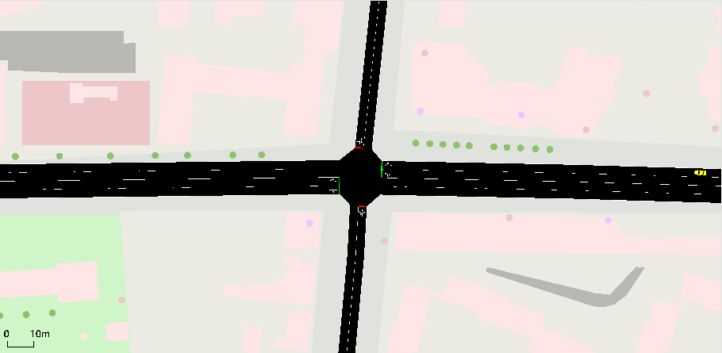
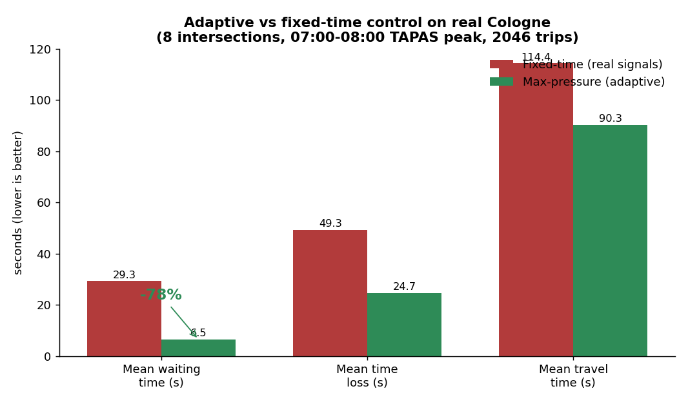
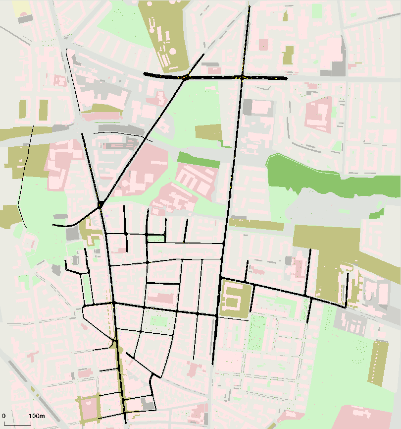

# 🚦 smart-traffic-rl

**Multi-agent reinforcement learning for adaptive traffic-signal control — evaluated on a *real* city network with *real* demand.**

[](https://www.python.org/)
[](https://pytorch.org/)
[](https://stable-baselines3.readthedocs.io/)
[](https://github.com/LucasAlegre/sumo-rl)
[](https://www.eclipse.org/sumo/)
[](https://www.openstreetmap.org/)
[](#-authors--license)

<p align="center">
  
  <br><em>Adaptive (max-pressure) control on the real Cologne network, in simulation — traffic flowing through a signalized intersection.</em>
</p>

---

## Overview

Traffic lights in most cities run on **fixed timing plans** that ignore live conditions. This project asks a concrete question: *can adaptive control — classical or learned — do better than the real fixed-time signals of an actual city?*

To answer it honestly, we built a **reproducible benchmark** on a **real 8-intersection district of Cologne, Germany**, driven by **real activity-based demand** (2,046 TAPAS trips over the 07:00–08:00 morning peak). Every controller is evaluated on **identical demand** with the **same metrics** (per-trip waiting time, time loss, travel time, and completed trips).

The project spans the full arc of a serious RL effort:

- **Synthetic phase** — SUMO environments for synthetic intersections (T-junction, 4-way crossroad, 2-light boulevard) with Gymnasium wrappers; **PPO agents (Stable-Baselines3) that converged** and controlled traffic. *(Now archived in [`legacy/`](legacy/).)*
- **Real-city phase** — a real OSM-imported Cologne district with real geometry, signal programs, and building footprints; a clean benchmark harness; classical and learned controllers; and a rigorous, honest evaluation of what works and what doesn't.

---

## Results

**Real Cologne district — 07:00–08:00 peak — 2,046 TAPAS trips. Lower is better.**

| Controller | Mean wait (s) | Mean time loss (s) | Mean travel (s) | Trips completed |
|---|--:|--:|--:|--:|
| fixed-time *(real OSM signal programs)* | 29.27 | 49.26 | 114.39 | 1995 |
| **max-pressure** *(classical adaptive — not ML)* | **6.46** | **24.69** | **90.28** | **2015** |

> **Headline:** **max-pressure cut mean waiting time by ~78% vs the real fixed-time signals (in simulation).**
> This result comes from **max-pressure — a *classical* adaptive control algorithm implemented from scratch, not a trained model.** It is the strong, validated baseline this project is built around.





*The real Cologne district rendered in `sumo-gui` with imported OSM building footprints.*

---

## Real network + real demand

This is **not** a toy grid. Everything is imported from real-world sources via the standard SUMO/OSM toolchain (`netconvert`, `polyconvert`):

- **Real road geometry** — the actual lanes, junctions, and connectivity of an 8-intersection Cologne district (RESCO benchmark scenario).
- **Real signal programs** — the city's actual fixed-time traffic-light plans, used directly as the `fixed-time` baseline.
- **Real building footprints** — OSM polygons, for a faithful rendering of the district.
- **Real demand** — **2,046 TAPAS activity-based trips** over the 07:00–08:00 morning peak. This is *derived from real activity patterns*, not random vehicle spawns — which is what makes the comparison credible against published traffic-RL work.

Because each junction is heterogeneous (different phase counts and approach layouts), the harness is built on **`sumo-rl`**, which handles variable-phase traffic lights generically and keeps the work focused on the *experiment* rather than the plumbing.

---

## Learned control (an open problem, honestly reported)

The classical max-pressure baseline is **strong** — and in the traffic-RL literature, it is *notoriously* strong. The genuine research question is therefore not "can RL beat fixed-time?" (it can) but **"can learned multi-agent control beat max-pressure?"** — and on this real network, that remains **open**.

We implemented and trained several learned controllers and investigated their behavior rigorously:

- **Custom shared-parameter IPPO** and a **CoLight-style graph-attention policy** (PyTorch) — trained, but they **collapsed into a gridlock local optimum**. A purpose-built **phase-usage visualizer** diagnosed the failure precisely: the policy *froze on fixed phases* (switching carries an immediate yellow-time cost, so the greedy policy learns "don't switch"), starving cross directions. Network queue ≈ **25 halted vehicles** vs max-pressure's ≈ **3** on the same slice.
- **RESCO's reference IPPO** — a "proven" agent run for **200 episodes** also failed to converge here: its best episode was #3 and the reward steadily *worsened* over training.

So **both** a from-scratch harness *and* a reference implementation failed to beat the classical baseline on this scenario — a result fully consistent with the literature, where max-pressure is a famously hard bar.

> **What this demonstrates:** the RL stack is implemented, trained, and **rigorously investigated** — including a custom diagnostic that pinpointed *why* the policies fail. Beating a strong classical baseline with learned control is an honest, well-characterized **open problem**, not a loose end. For contrast, the earlier **synthetic-environment PPO agents *did* converge** and control traffic — a working trained-model demonstration lives in [`legacy/`](legacy/).

Decisions, diagnostics, and the full results table are tracked in **[`PROJECT_LOG.md`](PROJECT_LOG.md)**.

---

## How to reproduce

```bash
# 1. Run the benchmark (fixed-time vs max-pressure on the real Cologne demand)
python src/realcity/baselines.py

# 2. Watch adaptive control run live in sumo-gui
python src/realcity/visualize_policy.py --controller maxpressure --gui

# 3. Open the real Cologne district yourself
sumo-gui -c envs/cologne8/cologne8.sumocfg
```

Requires **SUMO** installed with `SUMO_HOME` set, plus the Python dependencies (`pip install -r requirements.txt`).

> **Performance note:** training is bound by the **SUMO simulation**, not the small policy network. It runs on **CPU** with in-process **libsumo** and single-thread torch — a GPU does *not* help.

---

## Repository structure

```text
envs/             Real SUMO scenarios
└── cologne8/     Real 8-intersection Cologne district: net + signals + TAPAS demand + buildings
src/realcity/     The current work
├── cologne_env.py     sumo-rl environment factory
├── baselines.py       fixed-time + max-pressure controllers
└── ippo.py            shared-parameter IPPO harness
tools/            Network-building utilities (OSM import, decorate, rebuild)
legacy/           Original synthetic-intersection project (converged PPO; self-contained)
docs/             Rendered previews and the results chart
PROJECT_LOG.md    Architectural decisions (ADRs) + the measured results table
```

---

## Tech stack

**Python · PyTorch · Stable-Baselines3 · sumo-rl · SUMO (TraCI / libsumo) · OpenStreetMap (netconvert, polyconvert) · pandas · matplotlib · Git/GitHub**

**Skills demonstrated:** reinforcement learning & multi-agent RL · real-world data engineering (OSM import, calibrated activity-based demand) · rigorous benchmarking & reproducibility · performance optimization · scientific honesty and failure diagnosis.

---

## Authors & license

Developed by **Taha El Badaoui** and **Walid Hazzam** — engineering students in **Advanced Software Engineering for Digital Services (ASEDS)** at **INPT Rabat, Morocco** — for academic and research purposes.
